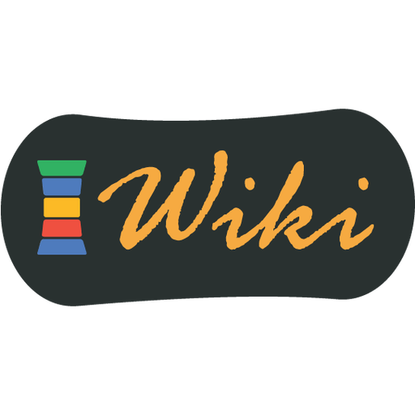

#  LG Wiki

LG Wiki is a modern, fast, and responsive documentation hub for the Liquid Galaxy project. It functions as an immersive documentation viewer, allowing developers, contributors, and users to browse guides and documentation fetched dynamically from the remote repository.

> [!NOTE]
> **Why LG Wiki?:** The Liquid Galaxy project is a complex, cluster-based multi-display system. Having a centralized, easily accessible wiki enables the global open-source community, Google Summer of Code (GSoC) contributors, and new users to share knowledge, document setups, and learn about the system.

---

## Features

- **🌍 Immersive Documentation Viewer**
  - Displays structured articles and guides dynamically fetched from our remote content repository.
  - Responsive design supporting layout zones, active-state navigation, and an interactive Table of Contents (TOC).
- **📱 Progressive Web App (PWA)**
  - Full offline support with a multi-tiered Service Worker caching strategy.
  - Installable on desktop, Android, and iOS for a native app experience.

---

## 🌐 Deployment

The web portal is hosted at: **[www.liquidgalaxy.eu/2024/05/lg-wiki.html#content-wrapper](https://www.liquidgalaxy.eu/2024/05/lg-wiki.html#content-wrapper)**.
It is optimized to load instantly, work offline, and serve as a reliable reference on the field.

---

## Technical Design & Caching

To maintain high performance and offline capability:
- **App Shell Cache:** Local HTML, CSS, JS, and CDN dependencies (Google Fonts, Material Web Components, syntax highlight libraries) are cached using a **Cache-First** strategy.
- **Dynamic Content Cache:** Markdown files from the content repository are fetched using a **Network-First** strategy with graceful cache fallback when offline.

---

## Contributing

Contributions to the LG Wiki and its content are welcome! Since the app is a read-only viewer, contributions are made directly on GitHub:
1. Clone or fork the [lg-wiki-content Repository](https://github.com/LiquidGalaxyLAB/lg-wiki-content).
2. Follow the [How to Contribute Guide](https://github.com/LiquidGalaxyLAB/lg-wiki-content/blob/main/how-to-contribute-to-lg-wiki.md) for detailed instructions on documentation submissions.
3. Open a pull request on GitHub with your markdown changes.

---

## 📄 License

This project is licensed under the [MIT License](LICENSE) - see the [LICENSE](LICENSE) file for details.

